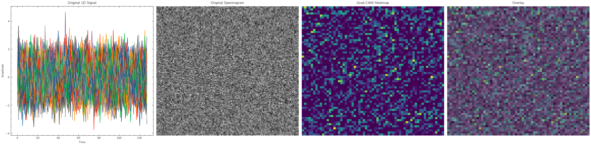
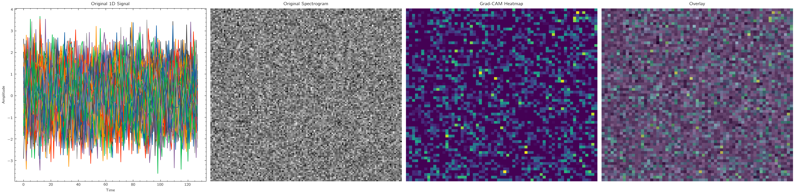
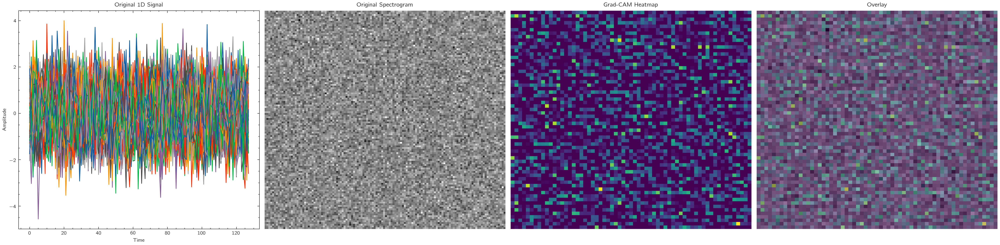
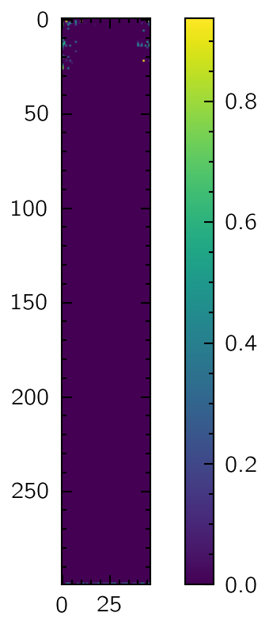

# Smart Grinding Model Report

## Model Performance Reports
# Detailed Statistical Performance Report

## Ae Features+Pp Input Combination

### Train MSE
|       |   Value |
|:------|--------:|
| count |   100   |
| mean  | 18413.2 |
| std   |  2514.7 |
| min   | 13609   |
| 25%   | 16475.1 |
| 50%   | 18388.1 |
| 75%   | 20184.2 |
| max   | 23987.2 |

### Test MSE
|       |    Value |
|:------|---------:|
| count |   100    |
| mean  | 18485.7  |
| std   |  4545.76 |
| min   |  9818.46 |
| 25%   | 14734    |
| 50%   | 18364.3  |
| 75%   | 20954    |
| max   | 29392.3  |

### Train MAE
|       |    Value |
|:------|---------:|
| count | 100      |
| mean  | 117.359  |
| std   |  24.1469 |
| min   |  82.4637 |
| 25%   |  94.2172 |
| 50%   | 116.11   |
| 75%   | 130.613  |
| max   | 181.548  |

### Test MAE
|       |    Value |
|:------|---------:|
| count | 100      |
| mean  | 116.038  |
| std   |  11.0325 |
| min   |  94.6619 |
| 25%   | 106.979  |
| 50%   | 116.433  |
| 75%   | 123.05   |
| max   | 141.747  |

## Pp Input Combination

### Train MSE
|       |    Value |
|:------|---------:|
| count |   100    |
| mean  | 18226.9  |
| std   |  3049.69 |
| min   | 12498.6  |
| 25%   | 15969.1  |
| 50%   | 18239.8  |
| 75%   | 20139.3  |
| max   | 26246.2  |

### Test MSE
|       |    Value |
|:------|---------:|
| count |   100    |
| mean  | 18492.2  |
| std   |  4540.71 |
| min   |  9313.97 |
| 25%   | 14934.9  |
| 50%   | 18504.5  |
| 75%   | 21149.8  |
| max   | 29162    |

### Train MAE
|       |    Value |
|:------|---------:|
| count | 100      |
| mean  | 117.801  |
| std   |  28.6702 |
| min   |  80.4233 |
| 25%   |  92.0551 |
| 50%   | 110.91   |
| 75%   | 131.459  |
| max   | 206.021  |

### Test MAE
|       |    Value |
|:------|---------:|
| count | 100      |
| mean  | 116.067  |
| std   |  11.0163 |
| min   |  92.5077 |
| 25%   | 107.247  |
| 50%   | 116.47   |
| 75%   | 123.339  |
| max   | 143.052  |

## Ae Spec+Ae Features+Vib Spec+Vib Features Input Combination

### Train MSE
|       |    Value |
|:------|---------:|
| count |   100    |
| mean  | 10630.7  |
| std   |  4180.43 |
| min   |  1993.77 |
| 25%   |  8025.97 |
| 50%   |  9878.97 |
| 75%   | 13482.4  |
| max   | 22499.1  |

### Test MSE
|       |    Value |
|:------|---------:|
| count |   100    |
| mean  |  9934.61 |
| std   |  4880.36 |
| min   |  1969.28 |
| 25%   |  6276.29 |
| 50%   |  9669.41 |
| 75%   | 12745.3  |
| max   | 29195.4  |

### Train MAE
|       |    Value |
|:------|---------:|
| count | 100      |
| mean  |  74.4116 |
| std   |  31.9835 |
| min   |  13.4816 |
| 25%   |  49.4532 |
| 50%   |  71.4975 |
| 75%   | 102.772  |
| max   | 164.316  |

### Test MAE
|       |    Value |
|:------|---------:|
| count | 100      |
| mean  |  66.734  |
| std   |  25.5245 |
| min   |  24.615  |
| 25%   |  45.3552 |
| 50%   |  65.1952 |
| 75%   |  83.0987 |
| max   | 140.621  |

## Vib Spec Input Combination

### Train MSE
|       |    Value |
|:------|---------:|
| count |   200    |
| mean  | 13882.6  |
| std   |  4661.82 |
| min   |  4184.66 |
| 25%   | 10298.2  |
| 50%   | 14015.3  |
| 75%   | 17199.4  |
| max   | 26972.7  |

### Test MSE
|       |    Value |
|:------|---------:|
| count |   200    |
| mean  | 13640.8  |
| std   |  5547.79 |
| min   |  1041.61 |
| 25%   |  9369.18 |
| 50%   | 12999.9  |
| 75%   | 17628.8  |
| max   | 27273.5  |

### Train MAE
|       |    Value |
|:------|---------:|
| count | 200      |
| mean  |  91.2171 |
| std   |  31.3575 |
| min   |  16.7489 |
| 25%   |  72.4771 |
| 50%   |  90.7274 |
| 75%   | 113.168  |
| max   | 175.384  |

### Test MAE
|       |    Value |
|:------|---------:|
| count | 200      |
| mean  |  90.1578 |
| std   |  24.6749 |
| min   |  20.2348 |
| 25%   |  71.3325 |
| 50%   |  91.4555 |
| 75%   | 108.359  |
| max   | 135.875  |

## All Input Combination

### Train MSE
|       |    Value |
|:------|---------:|
| count |   100    |
| mean  |  9720.86 |
| std   |  3811.71 |
| min   |  2613.96 |
| 25%   |  7086.28 |
| 50%   |  9438.17 |
| 75%   | 11799.7  |
| max   | 22619.7  |

### Test MSE
|       |    Value |
|:------|---------:|
| count |   100    |
| mean  |  9540.39 |
| std   |  4976.27 |
| min   |  2068.12 |
| 25%   |  5731.64 |
| 50%   |  8450.4  |
| 75%   | 11174.7  |
| max   | 24988.1  |

### Train MAE
|       |    Value |
|:------|---------:|
| count | 100      |
| mean  |  69.4329 |
| std   |  34.431  |
| min   |  10.9283 |
| 25%   |  46.221  |
| 50%   |  63.8256 |
| 75%   |  90.6586 |
| max   | 163.692  |

### Test MAE
|       |    Value |
|:------|---------:|
| count | 100      |
| mean  |  64.2615 |
| std   |  23.449  |
| min   |  24.3999 |
| 25%   |  46.9321 |
| 50%   |  61.6675 |
| 75%   |  75.0379 |
| max   | 124.769  |

## Ae Spec+Ae Features Input Combination

### Train MSE
|       |    Value |
|:------|---------:|
| count |   200    |
| mean  | 12025.4  |
| std   |  4422.72 |
| min   |  1993.77 |
| 25%   |  8552.69 |
| 50%   | 11847    |
| 75%   | 15250.8  |
| max   | 22505.5  |

### Test MSE
|       |    Value |
|:------|---------:|
| count |   200    |
| mean  | 11611    |
| std   |  5756.77 |
| min   |  1969.28 |
| 25%   |  6960.89 |
| 50%   | 11112.6  |
| 75%   | 15661.5  |
| max   | 29917.4  |

### Train MAE
|       |    Value |
|:------|---------:|
| count | 200      |
| mean  |  80.3879 |
| std   |  32.5999 |
| min   |  13.4816 |
| 25%   |  56.2405 |
| 50%   |  79.0448 |
| 75%   | 105.708  |
| max   | 164.316  |

### Test MAE
|       |    Value |
|:------|---------:|
| count | 200      |
| mean  |  76.8612 |
| std   |  28.7526 |
| min   |  24.615  |
| 25%   |  53.4961 |
| 50%   |  77.651  |
| 75%   | 101.751  |
| max   | 143.162  |

## Vib Features+Pp Input Combination

### Train MSE
|       |    Value |
|:------|---------:|
| count |   100    |
| mean  | 17933.3  |
| std   |  3117.07 |
| min   | 11616.5  |
| 25%   | 15869.6  |
| 50%   | 17758.2  |
| 75%   | 19723.5  |
| max   | 27882.8  |

### Test MSE
|       |    Value |
|:------|---------:|
| count |   100    |
| mean  | 18464.9  |
| std   |  4554.92 |
| min   |  9322.89 |
| 25%   | 14759.8  |
| 50%   | 18376.2  |
| 75%   | 20821.2  |
| max   | 29608.4  |

### Train MAE
|       |    Value |
|:------|---------:|
| count | 100      |
| mean  | 116.658  |
| std   |  24.4484 |
| min   |  82.4972 |
| 25%   |  92.1212 |
| 50%   | 116.037  |
| 75%   | 139.872  |
| max   | 190.352  |

### Test MAE
|       |    Value |
|:------|---------:|
| count | 100      |
| mean  | 115.94   |
| std   |  11.0743 |
| min   |  92.0063 |
| 25%   | 107.153  |
| 50%   | 116.121  |
| 75%   | 123.075  |
| max   | 142.606  |

## Ae Features Input Combination

### Train MSE
|       |   Value |
|:------|--------:|
| count |   200   |
| mean  | 19201.1 |
| std   |  3024   |
| min   | 12940.1 |
| 25%   | 17351.5 |
| 50%   | 19046.9 |
| 75%   | 21037.6 |
| max   | 29458.8 |

### Test MSE
|       |    Value |
|:------|---------:|
| count |   200    |
| mean  | 18919.8  |
| std   |  4595.91 |
| min   |  9818.46 |
| 25%   | 15182.8  |
| 50%   | 18700.1  |
| 75%   | 21663    |
| max   | 30363.9  |

### Train MAE
|       |    Value |
|:------|---------:|
| count | 200      |
| mean  | 121.522  |
| std   |  26.0707 |
| min   |  82.4637 |
| 25%   |  98.3434 |
| 50%   | 119.534  |
| 75%   | 133.803  |
| max   | 208.232  |

### Test MAE
|       |    Value |
|:------|---------:|
| count | 200      |
| mean  | 117.877  |
| std   |  11.1506 |
| min   |  94.6619 |
| 25%   | 109.281  |
| 50%   | 117.947  |
| 75%   | 125.577  |
| max   | 146.074  |

## Vib Spec+Vib Features Input Combination

### Train MSE
|       |    Value |
|:------|---------:|
| count |   100    |
| mean  | 13578.2  |
| std   |  4763.54 |
| min   |  4184.66 |
| 25%   |  9935.17 |
| 50%   | 13905.9  |
| 75%   | 17152.9  |
| max   | 26972.7  |

### Test MSE
|       |    Value |
|:------|---------:|
| count |   100    |
| mean  | 13554.2  |
| std   |  5883.66 |
| min   |  1041.61 |
| 25%   |  9114.37 |
| 50%   | 12891    |
| 75%   | 17591.5  |
| max   | 27273.5  |

### Train MAE
|       |    Value |
|:------|---------:|
| count | 100      |
| mean  |  89.7923 |
| std   |  32.453  |
| min   |  16.7489 |
| 25%   |  72.469  |
| 50%   |  88.6394 |
| 75%   | 113.609  |
| max   | 172.853  |

### Test MAE
|       |    Value |
|:------|---------:|
| count | 100      |
| mean  |  89.2716 |
| std   |  26.2702 |
| min   |  20.2348 |
| 25%   |  70.7492 |
| 50%   |  90.7193 |
| 75%   | 108.638  |
| max   | 135.875  |

## Ae Spec Input Combination

### Train MSE
|       |    Value |
|:------|---------:|
| count |   300    |
| mean  | 12618.4  |
| std   |  4457.94 |
| min   |  1993.77 |
| 25%   |  9073.22 |
| 50%   | 12549.6  |
| 75%   | 15908.2  |
| max   | 25028.7  |

### Test MSE
|       |    Value |
|:------|---------:|
| count |   300    |
| mean  | 12306.8  |
| std   |  5800.37 |
| min   |  1969.28 |
| 25%   |  7630.17 |
| 50%   | 11583.2  |
| 75%   | 16332.4  |
| max   | 29917.4  |

### Train MAE
|       |    Value |
|:------|---------:|
| count | 300      |
| mean  |  85.2858 |
| std   |  33.6941 |
| min   |  13.4816 |
| 25%   |  61.4984 |
| 50%   |  84.0766 |
| 75%   | 109.692  |
| max   | 203.732  |

### Test MAE
|       |    Value |
|:------|---------:|
| count | 300      |
| mean  |  81.4663 |
| std   |  27.8773 |
| min   |  24.615  |
| 25%   |  58.8838 |
| 50%   |  81.515  |
| 75%   | 105.095  |
| max   | 143.162  |

## Vib Features Input Combination

### Train MSE
|       |    Value |
|:------|---------:|
| count |   200    |
| mean  | 18382.3  |
| std   |  2887.01 |
| min   | 11616.5  |
| 25%   | 16357.2  |
| 50%   | 18454.4  |
| 75%   | 20395.2  |
| max   | 27882.8  |

### Test MSE
|       |    Value |
|:------|---------:|
| count |   200    |
| mean  | 18908.1  |
| std   |  4600.29 |
| min   |  9322.89 |
| 25%   | 15258.2  |
| 50%   | 18602.5  |
| 75%   | 21629.6  |
| max   | 30374.3  |

### Train MAE
|       |    Value |
|:------|---------:|
| count | 200      |
| mean  | 117.202  |
| std   |  23.9863 |
| min   |  82.4972 |
| 25%   |  94.8159 |
| 50%   | 113.627  |
| 75%   | 130.9    |
| max   | 190.352  |

### Test MAE
|       |    Value |
|:------|---------:|
| count | 200      |
| mean  | 117.823  |
| std   |  11.1738 |
| min   |  92.0063 |
| 25%   | 109.133  |
| 50%   | 118.182  |
| 75%   | 125.429  |
| max   | 145.986  |

## Explainable AI Reports
### Ae Features+Pp Inputs
### Pp Inputs
### Ae Spec+Ae Features+Vib Spec+Vib Features Inputs

### Vib Spec Inputs

### All Inputs
### Ae Spec+Ae Features Inputs

### Vib Features+Pp Inputs
### Ae Features Inputs
### Vib Spec+Vib Features Inputs

### Ae Spec Inputs

### Vib Features Inputs
